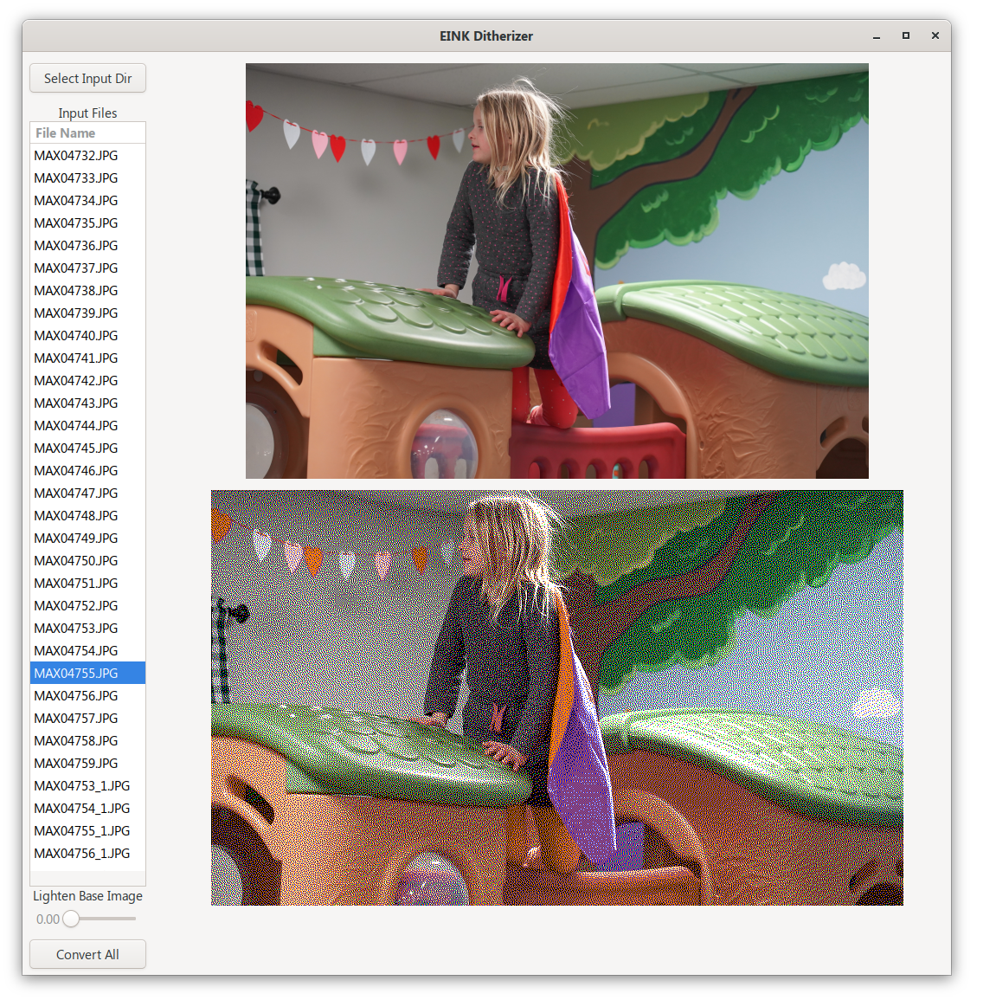

# ConvertEink
I Bought a 800x480 Eink display and converting images was less than optimal, also, lightenting is easier

Using C# and GTKSharp

I also added the ability to "Lighten up" the picture as the display tends to be dim.

Tested on Linux

Go to Relases and download for Windows Linux or Mac